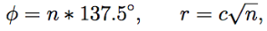
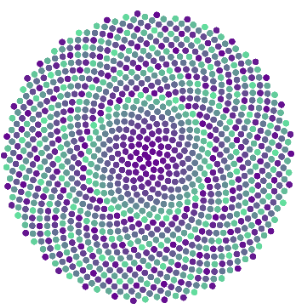

Reto Gráfico 1: Phyllotaxis
======

Referencias: [http://algorithmicbotany.org/papers/abop/abop-ch4.pdf](http://algorithmicbotany.org/papers/abop/abop-ch4.pdf)

Implementar la función phyllotaxis, la cual implementa el algoritmo de phyllotaxis.

* No debe de tener fin la creación de nuevos puntos
* No es necesario modificar el color de los puntos, pero es divertido

## Ejemplo 

